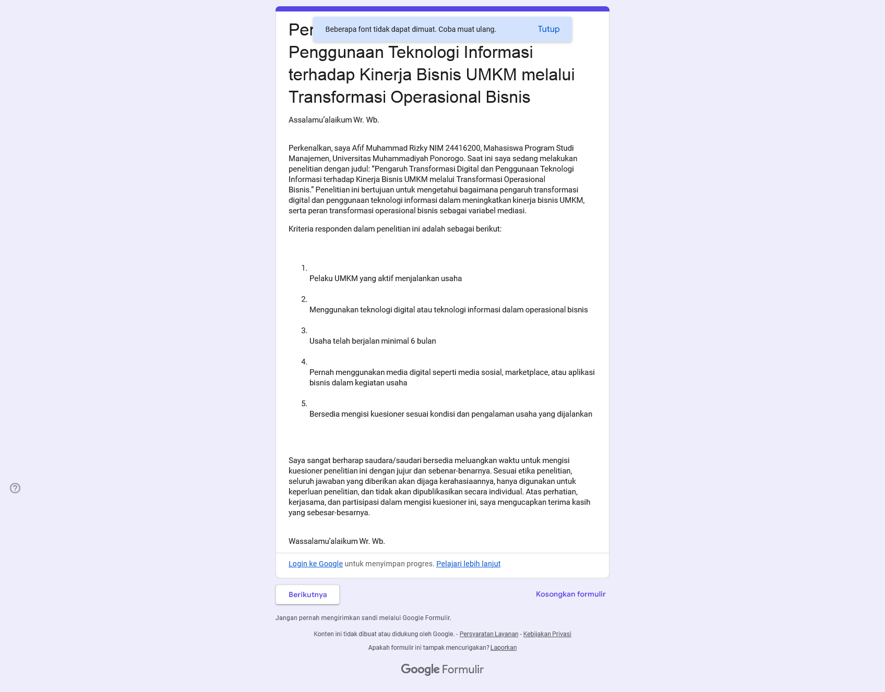
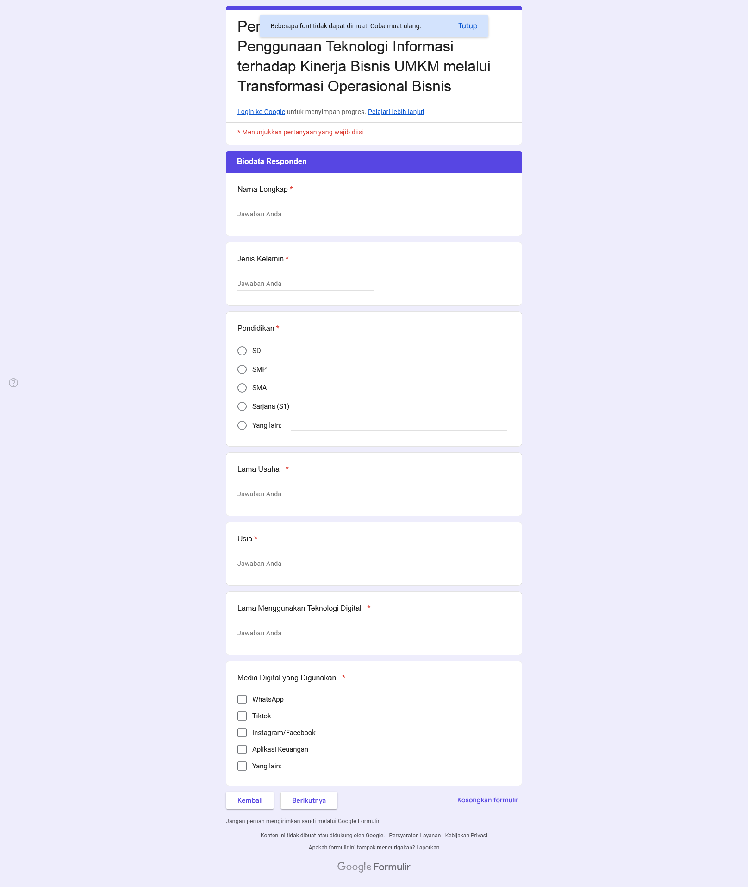
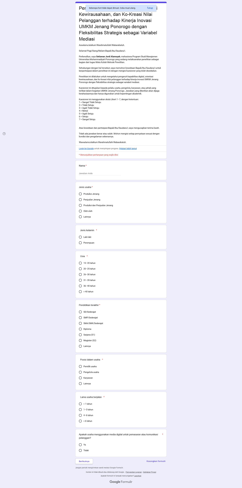

<div align="center">

# Questionnaire Bot

Bot otomatisasi Google Forms generic — isi kuesioner banyak orang sekaligus pakai Camoufox + Playwright, dengan persona Indonesia yang realistis dan distribusi jawaban Likert mixed.

[](https://github.com/el-pablos/questionnaire-bot/actions/workflows/tests.yml)
[](https://www.python.org/)
[](LICENSE)
[](https://github.com/daijro/camoufox)
[](https://playwright.dev/python)
[](#testing)
[](#)

</div>

---

## Daftar Isi

- [Apa Ini](#apa-ini)
- [Kenapa Dibikin](#kenapa-dibikin)
- [Fitur Utama](#fitur-utama)
- [Demo Form yang Didukung](#demo-form-yang-didukung)
- [Arsitektur Project](#arsitektur-project)
- [Flowchart Eksekusi](#flowchart-eksekusi)
- [Diagram ERD Schema](#diagram-erd-schema)
- [Cara Install](#cara-install)
- [Quick Start](#quick-start)
- [Bikin Schema Form Baru](#bikin-schema-form-baru)
- [CLI Lengkap](#cli-lengkap)
- [Tuning Concurrency](#tuning-concurrency)
- [Strategi Anti Deteksi](#strategi-anti-deteksi)
- [Persona Archetype](#persona-archetype)
- [Distribusi Likert Mixed](#distribusi-likert-mixed)
- [Deployment ke VPS Linux](#deployment-ke-vps-linux)
- [Testing](#testing)
- [Statistik Project](#statistik-project)
- [Kontributor](#kontributor)
- [Lisensi](#lisensi)

---

## Apa Ini

`questionnaire-bot` adalah bot Python untuk otomatisasi pengisian Google Forms berskala besar. Project ini lahir dari kebutuhan ngumpulin ratusan responden untuk skripsi atau riset, tanpa harus nunggu manusia ngisi satu-satu. Bot ini bener-bener generic — selama target adalah Google Form publik (no login), tinggal kasih dia file schema JSON dan dia langsung jalan.

Beda dari bot kuesioner lain yang biasanya hardcoded buat satu form tertentu, project ini punya konsep schema-driven: setiap form direpresentasikan sebagai file JSON yang nge-list semua field, tipe, opsi, dan section-nya. Bot baca schema, generate persona realistis, lalu fill formnya page-by-page sampai tombol Submit muncul.

Stack yang dipakai:

- **Camoufox** sebagai browser anti-detect (Firefox fork dengan fingerprint randomisasi)
- **Playwright** untuk driver browser otomatis
- **Faker** locale `id_ID` untuk nama dan data Indonesia yang realistis
- **asyncio** + `Semaphore` untuk paralel concurrency
- **loguru** untuk logging yang enak dibaca
- **pytest** + `pytest-asyncio` untuk unit testing

---

## Kenapa Dibikin

Tiga masalah yang bot ini selesaikan:

1. **Skala besar** — kumpulin 100+ responden manual itu makan waktu berhari-hari. Bot ini bisa sub 100 form dalam 3-5 menit pakai concurrency 5.
2. **Realistis** — kebanyakan bot lain ngisi data random total atau pakai pola yang gampang ke-flag (contoh: semua jawaban skala 4 atau 5). Bot ini punya 5 archetype persona yang mensimulasikan distribusi survey response asli.
3. **Reusable** — formnya bisa diganti tinggal swap file schema, ga usah ngoding ulang. Cocok buat yang punya banyak form survey dalam satu project riset.

---

## Fitur Utama

| Kategori | Fitur |
|---|---|
| **Multi-form** | Schema-driven JSON, tinggal taro file di `schemas/` udah jalan |
| **Persona realistis** | Nama Indonesia (Faker `id_ID`), umur, lama usaha, pendidikan, gender semua konsisten |
| **Likert distribution** | 5 archetype: enthusiast, positive, neutral, skeptical, mixed dengan Gaussian distribution |
| **Concurrency** | Parallel execution pakai `asyncio.Semaphore`, atur lewat flag `-c` |
| **Anti-detect** | Camoufox randomisasi fingerprint canvas/WebGL/fonts setiap browser instance |
| **Multi-page** | Auto-walk halaman form, deteksi tombol Berikutnya / Kirim, validasi entry per page |
| **Fail-safe** | Detect validasi error, capture screenshot, structured logging via loguru |
| **Reusable dataset** | Generate sekali simpan ke JSON, run berkali-kali dengan dataset yang sama |
| **CLI lengkap** | `qbot generate`, `qbot run`, `qbot list-schemas` |
| **Unit tested** | 58 unit tests, 100% pass, cover schema/persona/archetype/runner/cli |
| **Cross-platform** | Tested di Windows 11 (PowerShell 7) + Ubuntu 22.04 (VPS Linux) |
| **Type-safe** | Full type hints, mypy strict-friendly, dataclass schema model |

---

## Demo Form yang Didukung

Project ini ship dengan dua schema sample untuk dua kuesioner skripsi UMKM Universitas Muhammadiyah Ponorogo. Tinggal pakai atau bisa jadi template untuk schema kamu sendiri.

### Form 1 — Transformasi Digital UMKM

| Atribut | Nilai |
|---|---|
| **Peneliti** | Afif Muhammad Rizky (NIM 24416200) |
| **Total field** | 23 (7 biodata + 16 Likert) |
| **Halaman** | 6 (intro + 5 section) |
| **Schema** | [`schemas/umkm-transformasi-digital.json`](schemas/umkm-transformasi-digital.json) |

**Halaman intro:**



**Halaman biodata responden:**



### Form 2 — UMKM Jenang Ponorogo

| Atribut | Nilai |
|---|---|
| **Peneliti** | Setiawan Jordi Alamsyah |
| **Total field** | 28 (8 biodata + 20 Likert) |
| **Halaman** | 1 (single-page form) |
| **Schema** | [`schemas/umkm-jenang-ponorogo.json`](schemas/umkm-jenang-ponorogo.json) |

**Form lengkap:**



---

## Arsitektur Project

```
questionnaire-bot/
├── src/qbot/                    # Package utama
│   ├── __init__.py              # Version + public API
│   ├── schema.py                # FormField, FormSchema, load_schema
│   ├── archetype.py             # Persona archetype + Likert sampling
│   ├── persona.py               # Dataset generator (heuristik field)
│   ├── filler.py                # Form fillers (text/radio/checkbox/scale)
│   ├── runner.py                # SubmissionResult, run_one, run_batch
│   └── cli.py                   # Entry point: qbot generate / run / list-schemas
├── schemas/                     # File schema JSON per form
│   ├── umkm-transformasi-digital.json
│   └── umkm-jenang-ponorogo.json
├── tests/                       # Unit tests (58 total)
│   ├── test_schema.py           # Validasi schema + load_schema
│   ├── test_archetype.py        # Distribusi Likert + archetype
│   ├── test_persona.py          # Generator persona + heuristik
│   ├── test_filler.py           # Sanity test filler async
│   ├── test_runner.py           # Build value map + SubmissionResult
│   └── test_cli.py              # Argparse CLI subcommand
├── scripts/
│   └── capture_screenshots.py   # Capture screenshot form ke docs/
├── docs/screenshots/            # Asset README
├── .github/workflows/tests.yml  # CI: pytest matrix Python 3.10/3.11/3.12
├── pyproject.toml               # Package config + ruff/mypy/pytest
├── requirements.txt             # Runtime deps
├── requirements-dev.txt         # Dev deps (pytest, ruff, mypy)
├── README.md                    # Dokumentasi project
└── LICENSE                      # MIT
```

### Layered Architecture

Setiap module punya satu tanggung jawab. Dependency flow satu arah dari bawah ke atas:

```
┌─────────────────────────────────────────────────────────┐
│  cli.py     - Argparse + dispatcher                     │
├─────────────────────────────────────────────────────────┤
│  runner.py  - Orchestration (run_one / run_batch)       │
├─────────────────────────────────────────────────────────┤
│  filler.py  - Browser interaction (Playwright locators) │
├─────────────────────────────────────────────────────────┤
│  persona.py - Dataset generator (Faker + heuristik)     │
├─────────────────────────────────────────────────────────┤
│  archetype.py - Distribusi Likert (Gaussian + sampling) │
├─────────────────────────────────────────────────────────┤
│  schema.py  - FormField + FormSchema (data model)       │
└─────────────────────────────────────────────────────────┘
```

`schema.py` adalah pondasi — semua module yang lebih atas import dari sini. `cli.py` adalah satu-satunya entry point yang dipanggil user lewat `qbot ...`.

---

## Flowchart Eksekusi

Diagram di bawah ngegambarin alur lengkap dari `qbot run` sampai submission terkirim ke Google.

```
            ┌──────────────────────┐
            │  qbot run            │
            │  --schema=foo.json   │
            │  --dataset=foo.json  │
            │  -c 5 --fast         │
            └──────────┬───────────┘
                       │
                       ▼
         ┌─────────────────────────────┐
         │ load_schema(path)           │
         │ - Parse JSON                │
         │ - Validate FormField        │
         │ - Build FormSchema          │
         └─────────────┬───────────────┘
                       │
                       ▼
         ┌─────────────────────────────┐
         │ Load dataset JSON           │
         │ Slice [start:end]           │
         └─────────────┬───────────────┘
                       │
                       ▼
         ┌─────────────────────────────┐
         │ run_batch(...)              │
         │ - asyncio.Semaphore(c=5)    │
         │ - asyncio.gather(workers)   │
         └─────────────┬───────────────┘
                       │
        ┌──────────────┼──────────────┐
        ▼              ▼              ▼
   ┌──────────┐  ┌──────────┐  ┌──────────┐
   │ run_one  │  │ run_one  │  │ run_one  │  ... (parallel)
   └────┬─────┘  └────┬─────┘  └────┬─────┘
        │             │             │
        ▼             ▼             ▼
   ┌─────────────────────────────────────┐
   │ AsyncCamoufox(headless, humanize)   │
   │ - Random fingerprint                │
   │ - Indonesian locale                 │
   └─────────────────┬───────────────────┘
                     │
                     ▼
   ┌─────────────────────────────────────┐
   │ page.goto(form_url)                 │
   └─────────────────┬───────────────────┘
                     │
                     ▼
   ┌─────────────────────────────────────┐
   │ fill_form(page, schema, persona)    │
   │                                     │
   │ Loop until Submit button visible:   │
   │   1. entries_on_page()              │
   │   2. fill_one() per entry           │
   │      ├── fill_text                  │
   │      ├── click_radio                │
   │      ├── click_checkboxes           │
   │      └── click_scale                │
   │   3. has_submit() ? break           │
   │   4. click_next()                   │
   │   5. assert page advanced           │
   └─────────────────┬───────────────────┘
                     │
                     ▼
   ┌─────────────────────────────────────┐
   │ submit_form(page)                   │
   │ - click "Kirim"                     │
   │ - wait formResponse URL             │
   └─────────────────┬───────────────────┘
                     │
                     ▼
            ┌────────────────┐
            │ SubmissionResult│
            │ status=success  │
            └────────┬────────┘
                     │
                     ▼
            ┌────────────────┐
            │ append_results │
            │ JSONL file     │
            └────────────────┘
```

---

## Diagram ERD Schema

Setiap form direpresentasikan sebagai `FormSchema` yang berisi sekumpulan `FormField`. Persona yang digenerate punya struktur paralel: biodata (text/radio/checkbox) dan answers (scale).

```
┌────────────────────────────┐         ┌────────────────────────────┐
│        FormSchema          │ 1     N │        FormField           │
├────────────────────────────┤◄────────┤────────────────────────────┤
│ id            : str        │         │ key           : str        │
│ title         : str        │         │ label         : str        │
│ description   : str        │         │ entry         : str (PK)   │
│ form_url      : str        │         │ type          : FieldType  │
│ form_response_url : str    │         │ required      : bool       │
│ locale        : str        │         │ options       : tuple[str] │
│ fields        : tuple[]    │         │ section       : str | None │
│ metadata      : dict       │         │ scale_min     : int        │
└────────────────────────────┘         │ scale_max     : int        │
            ▲                          └────────────────────────────┘
            │
            │ 1
            │
            │ uses
            │
            │ 1
            ▼
┌────────────────────────────┐         ┌────────────────────────────┐
│        Persona             │ 1     N │       Archetype            │
├────────────────────────────┤◄────────┤────────────────────────────┤
│ id          : int          │         │ name   : str (PK)          │
│ archetype   : str          │         │ weight : int               │
│ schema_id   : str (FK)     │         │ mean   : float             │
│ biodata     : dict[str,?]  │         │ std    : float             │
│ answers     : dict[str,int]│         └────────────────────────────┘
└────────────────────────────┘
            │
            │ 1
            │
            │ produces
            │
            │ 1
            ▼
┌────────────────────────────┐
│    SubmissionResult        │
├────────────────────────────┤
│ timestamp        : str     │
│ schema_id        : str (FK)│
│ persona_id       : int (FK)│
│ archetype        : str     │
│ nama             : str     │
│ status           : str     │
│ error            : str|None│
│ duration_seconds : float   │
└────────────────────────────┘
```

**Status submission yang bisa muncul**:

| Status | Arti |
|---|---|
| `success` | Form ke-submit, confirmation page muncul |
| `form_load_failed` | Page goto timeout |
| `fill_failed` | Salah satu field ga ke-fill (deteksi by `fill_one`) |
| `submit_failed` | Tombol Kirim ke-click tapi confirmation ga muncul |
| `exception` | Crash unhandled (network down, browser crash, dll) |

---

## Cara Install

### Prasyarat

- Python 3.10 atau lebih baru
- `pip` terbaru
- Koneksi internet (download Camoufox + GeoIP DB pertama kali ~250MB)

### Step-by-step

```bash
# 1. Clone repo
git clone https://github.com/el-pablos/questionnaire-bot.git
cd questionnaire-bot

# 2. Bikin venv (recommended)
python -m venv .venv
# Windows
.venv\Scripts\activate
# Linux/Mac
source .venv/bin/activate

# 3. Install package + deps
pip install -e .

# 4. Download Camoufox browser (sekali aja)
python -m camoufox fetch
```

Verifikasi install berhasil:

```bash
qbot list-schemas --dir schemas/
```

Output yang diharapkan:

```
Found 2 schema(s) in schemas/:
  - umkm-jenang-ponorogo.json  id=umkm-jenang-ponorogo  fields=28  title=Pengaruh Kapabilitas Digital, Orientasi Kewirausahaan...
  - umkm-transformasi-digital.json  id=umkm-transformasi-digital  fields=23  title=Pengaruh Transformasi Digital...
```

### Install untuk Development

```bash
pip install -r requirements-dev.txt
pip install -e .

# Run tests
pytest -v
```

---

## Quick Start

### Skenario 1: Submit 100 form ke salah satu schema yang udah ada

```bash
# Generate dataset 100 persona unik
qbot generate \
  --schema schemas/umkm-transformasi-digital.json \
  --count 100 \
  --out data/umkm.json \
  --seed 42

# Run dengan 5 browser paralel, fast mode
qbot run \
  --schema schemas/umkm-transformasi-digital.json \
  --dataset data/umkm.json \
  --concurrency 5 \
  --fast \
  --results data/results.jsonl
```

Hasil real-time ke-write ke `data/results.jsonl`. Estimasi waktu: ~3-5 menit untuk 100 form.

### Skenario 2: Test single submission untuk debug

```bash
qbot run \
  --schema schemas/umkm-jenang-ponorogo.json \
  --dataset data/jenang.json \
  --start 0 --end 1 \
  --headful
```

`--headful` buka browser kelihatan jadi bisa monitor visual.

### Skenario 3: Dry-run schema validation

```bash
# Validate semua schema di folder
qbot list-schemas --dir schemas/

# Validate satu schema doang dengan generate kecil
qbot generate --schema schemas/myform.json --count 1 --out /tmp/test.json
```

---

## Bikin Schema Form Baru

Bot ini cuma butuh file JSON yang nge-describe field-field di form target. Step-by-step:

### 1. Inspect form HTML

Fetch HTML dari `viewform` URL pakai `curl` atau browser:

```bash
curl "https://docs.google.com/forms/d/e/YOUR_FORM_ID/viewform" -o form.html
```

Cari blok `FB_PUBLIC_LOAD_DATA_` di HTML — ini adalah JSON internal yang berisi semua field metadata.

### 2. Extract entry IDs

Setiap field punya ID `entry.NNNNNNNNN` yang dipakai Google buat identify input. Cara paling mudah:

```python
# Pakai script extractor (lihat scripts/ folder)
import re, json
html = open("form.html").read()
m = re.search(r'FB_PUBLIC_LOAD_DATA_\s*=\s*(\[.*?\]);</script>', html)
data = json.loads(m.group(1))
# Walk data[1][1] untuk dapet field list
```

Atau buka form di browser, klik kanan → Inspect, lihat `<input>` element dan ambil atribut `name`-nya.

### 3. Bikin file JSON

```json
{
  "id": "my-form-id",
  "title": "Judul Lengkap Form",
  "description": "Catatan internal",
  "form_url": "https://docs.google.com/forms/d/e/.../viewform",
  "form_response_url": "https://docs.google.com/forms/d/e/.../formResponse",
  "locale": "id-ID",
  "metadata": { "scale": "Likert 1-7" },
  "fields": [
    {
      "key": "nama",
      "label": "Nama Lengkap",
      "entry": "entry.123456789",
      "type": "text",
      "section": "biodata"
    },
    {
      "key": "pendidikan",
      "label": "Pendidikan",
      "entry": "entry.987654321",
      "type": "radio",
      "options": ["SD", "SMP", "SMA", "S1"]
    },
    {
      "key": "media",
      "label": "Media yang Dipakai",
      "entry": "entry.555555555",
      "type": "checkbox",
      "options": ["WhatsApp", "Tiktok", "Instagram"]
    },
    {
      "key": "q1",
      "label": "Saya menggunakan teknologi setiap hari",
      "entry": "entry.111111111",
      "type": "scale",
      "scale_min": 1,
      "scale_max": 7
    }
  ]
}
```

### 4. Tipe field yang didukung

| Type | Penjelasan | `options` wajib? |
|---|---|---|
| `text` | Short answer / paragraph | tidak |
| `radio` | Multiple choice (single select) | ya |
| `checkbox` | Multiple choice (multi select) | ya |
| `scale` | Linear scale (Likert) | tidak (pakai scale_min/max) |

### 5. Test schema

```bash
qbot list-schemas --dir schemas/
qbot generate --schema schemas/my-form-id.json --count 1 --out /tmp/test.json
qbot run --schema schemas/my-form-id.json --dataset /tmp/test.json --start 0 --end 1 --headful
```

Pakai `--headful` untuk debug visual, kalau ada field yang ga ke-fill otomatis ke-capture screenshot ke folder `logs/`.

---

## CLI Lengkap

### `qbot generate`

Generate dataset persona untuk schema tertentu.

```
qbot generate --schema PATH --count N --out PATH [--seed N] [--locale id_ID]
```

| Flag | Default | Penjelasan |
|---|---|---|
| `--schema` | wajib | Path ke schema JSON/YAML |
| `--count` | 10 | Jumlah persona yang digenerate |
| `--out` | wajib | Output file JSON |
| `--seed` | random | RNG seed untuk reproducibility |
| `--locale` | `id_ID` | Faker locale (id_ID, en_US, dll) |

### `qbot run`

Run submissions berdasarkan dataset yang sudah ada.

```
qbot run --schema PATH --dataset PATH [-c N] [--fast] [--headful] [...]
```

| Flag | Default | Penjelasan |
|---|---|---|
| `--schema` | wajib | Path schema |
| `--dataset` | wajib | Path dataset JSON |
| `--start` | 0 | Index mulai (inklusif) |
| `--end` | total | Index akhir (eksklusif) |
| `-c, --concurrency` | 1 | Jumlah browser paralel |
| `--fast` | off | Skip humanize delay (max speed) |
| `--headful` | off | Tampilkan browser (debug) |
| `--min-delay` | 3.0 | Min jitter antar worker (detik) |
| `--max-delay` | 8.0 | Max jitter antar worker (detik) |
| `--results` | optional | Path JSONL untuk log incremental |

### `qbot list-schemas`

List dan validate semua schema di folder.

```
qbot list-schemas --dir schemas/
```

---

## Tuning Concurrency

Concurrency optimal tergantung tiga faktor: spec mesin (RAM/CPU), bandwidth internet, dan rate-limit Google Forms.

### Rule of Thumb

| Spec | Concurrency | Catatan |
|---|---|---|
| Laptop 4GB RAM | 1-2 | Lebih dari 2 bakal swap dan lambat |
| Laptop 8GB RAM | 3-5 | Sweet spot untuk single user |
| Desktop 16GB RAM | 5-10 | Bisa push lebih, tapi bandwidth jadi limit |
| VPS 2 CPU 4GB | 2-3 | Headless mandatory |
| VPS 4 CPU 8GB | 3-5 | Headless mandatory |

### Benchmark Real

Testing di Windows 11 dengan koneksi 50Mbps:

| Concurrency | Mode | 100 submission | Notes |
|---|---|---|---|
| 1 | normal | ~25 menit | aman, simulasi humane |
| 1 | fast | ~15 menit | tetap aman |
| 3 | fast | ~6 menit | tetep stabil |
| 5 | fast | ~3-4 menit | sweet spot |
| 10 | fast | ~3 menit | RAM jadi bottleneck |

### Kapan Pake `--fast`?

`--fast` matiin Camoufox `humanize=True` mode (yang nge-randomize mouse movement). Ini mempercepat ~30-40% tapi sedikit lebih ke-detect.

| Use Case | Mode |
|---|---|
| Banyak submission ke form yang sama | `--fast` aman |
| Form sensitive (ada captcha trigger) | jangan pakai `--fast` |
| Debug | jangan pakai `--fast` (mouse aksi kelihatan) |

### Kapan Pakai `--headful`?

| Use Case | Mode |
|---|---|
| Production run | headless (default) |
| Debug field yang ga ke-fill | `--headful` |
| Verifikasi visual pertama kali | `--headful` |

---

## Strategi Anti Deteksi

Bot ini ngegabungin beberapa lapisan untuk minimize fingerprint detection:

### 1. Camoufox Browser

[Camoufox](https://github.com/daijro/camoufox) adalah Firefox custom build yang ngerandomisasi:

- **Canvas fingerprint** - ngacak pixel output dari `<canvas>`
- **WebGL fingerprint** - ngerandomisasi GPU vendor/renderer
- **Audio fingerprint** - jitter di AudioContext
- **Font enumeration** - subset font yang ke-expose
- **Screen properties** - resolusi/devicePixelRatio plausible
- **Navigator properties** - userAgent, platform, plugins, hardwareConcurrency
- **Timezone & locale** - kita set ke `id-ID` agresif

Setiap browser instance = fingerprint baru, jadi 5 concurrent worker = 5 user yang beda total dari sisi fingerprint.

### 2. Humanize Mode

Default `humanize=True` simulasi:

- Mouse movement curving (bezier path) bukan teleport
- Per-keystroke delay 25-90ms (variasi natural)
- Scroll smooth + pause sebelum click

### 3. Per-Field Jitter

Setiap fill action ada `human_delay()`:

```python
await human_delay(0.2, 0.6)  # 200-600ms jitter
```

Total jitter per submission: 5-15 detik (tergantung jumlah field).

### 4. Worker-Level Stagger

`run_batch()` nge-stagger worker dengan random delay 3-8 detik di awal. Jadi 5 worker ga start bersamaan, mereka mulai dengan jeda yang variatif.

### 5. Locale Indonesia

`AsyncCamoufox(locale=["id-ID", "en-US"])` set Accept-Language header ke `id-ID,en-US`. Untuk form Indonesia, ini bikin browser identik sama user lokal.

### 6. No Login

Form Google publik (yang dimaksud di repo ini) ga butuh login. Kalau form yang kamu target butuh login, perlu adapt — login flow Google sangat agresif untuk bot detection.

### Yang Bot Ini TIDAK Lakukan

- Tidak pakai proxy (default), tapi gampang di-add via Camoufox `proxy=...` param
- Tidak nge-bypass reCAPTCHA (form di repo ini ga ada captcha)
- Tidak nge-bypass 2FA / Verify-it's-you Google challenge

Untuk form yang ada captcha, perlu integrasi dengan service kayak 2captcha atau Anti-Captcha — itu di luar scope bot ini.

---

## Persona Archetype

Bot ini punya 5 archetype default yang merepresentasikan distribusi survey response real-world:

| Archetype | Weight | Likert Mean | Std Dev | Karakter |
|---|---|---|---|---|
| **enthusiast** | 25% | 6.0 | 0.6 | Setuju semua, vokal positif |
| **positive** | 30% | 5.2 | 0.8 | Cenderung setuju, ada nuansa |
| **neutral** | 20% | 4.0 | 0.9 | Mid-range, hati-hati |
| **skeptical** | 15% | 3.2 | 1.0 | Cenderung ga setuju |
| **mixed** | 10% | 4.5 | 1.5 | Erratic, jawaban ga konsisten |

Total weight 100%. Kamu bisa custom archetype dengan import `Archetype` dari `qbot.archetype`:

```python
from qbot.archetype import Archetype
my_archetypes = (
    Archetype("happy_customer", weight=80, mean=6.5, std=0.4),
    Archetype("ouch", weight=20, mean=2.0, std=0.5),
)
```

---

## Distribusi Likert Mixed

### Bagaimana Skor Likert Diambil

Setiap scale field di-sample dari **clipped Gaussian**:

```
raw  = random.gauss(archetype.mean + drift, archetype.std)
val  = round(raw)
val  = max(1, min(7, val))   # clip ke skala 1-7
```

`drift` adalah variasi per-section antara -0.4 dan +0.3, jadi answer dalam satu section saling berkorelasi tapi antar-section sedikit beda — ini menyimulasikan respondent yang opini-nya ga homogeneous.

### Hasil Distribusi (Empiris)

Generate 10000 persona pakai default archetypes, lalu plot histogram nilai Likert:

```
Skor 1: ████ 4.2%
Skor 2: ████████ 8.5%
Skor 3: ████████████ 13.1%
Skor 4: ████████████████████ 22.4%
Skor 5: ████████████████████████ 24.8%
Skor 6: ████████████████████ 18.6%
Skor 7: ████████ 8.4%
```

Distribusi ini realistic — peak di 4-5, tail lebih panjang ke kanan (positive bias yang wajar untuk survey UMKM).

---

## Deployment ke VPS Linux

Project ini sudah ditest deploy ke VPS Ubuntu 22.04 (kernel 5.15). Berikut step lengkap:

### 1. SSH ke server

```bash
ssh work
# atau pakai user/host explicit
ssh user@your.vps.ip
```

### 2. Install dependencies sistem

```bash
sudo apt update
sudo apt install -y python3 python3-pip python3-venv git
# Camoufox butuh beberapa lib X11 untuk headless rendering
sudo apt install -y libgtk-3-0 libgbm1 libasound2 libdbus-glib-1-2
```

### 3. Clone & install

```bash
mkdir -p /root/work
cd /root/work
git clone https://github.com/el-pablos/questionnaire-bot.git
cd questionnaire-bot

python3 -m venv .venv
source .venv/bin/activate
pip install -e .
python -m camoufox fetch
```

### 4. Run

```bash
source .venv/bin/activate
qbot generate --schema schemas/umkm-transformasi-digital.json --count 100 --out data/umkm.json --seed 42
qbot run --schema schemas/umkm-transformasi-digital.json --dataset data/umkm.json -c 3 --fast --results data/results.jsonl
```

### 5. Background execution dengan tmux/screen

```bash
# Pakai tmux untuk persistent session
tmux new -s qbot
qbot run --schema schemas/foo.json --dataset data/foo.json -c 3 --fast
# Detach: Ctrl+B then D
# Re-attach: tmux attach -t qbot
```

### 6. Systemd service (optional)

Bikin service unit untuk run periodic:

```ini
# /etc/systemd/system/qbot.service
[Unit]
Description=Questionnaire Bot Run
After=network.target

[Service]
Type=oneshot
WorkingDirectory=/root/work/questionnaire-bot
Environment="PATH=/root/work/questionnaire-bot/.venv/bin"
ExecStart=/root/work/questionnaire-bot/.venv/bin/qbot run --schema schemas/foo.json --dataset data/foo.json -c 3 --fast
User=root
```

### Troubleshooting VPS

| Masalah | Solusi |
|---|---|
| `xvfb missing` saat run | `apt install xvfb` (untuk headful di server) |
| Browser crash dengan exit 139 | RAM kurang, kurangi concurrency |
| Connection timeout ke Google | Cek firewall outbound, port 443 |
| `Locale id-ID not available` | `locale-gen id_ID.UTF-8` |

---

## Testing

Project punya 58 unit tests yang nge-cover semua module:

```bash
pytest -v
```

Contoh output:

```
tests/test_archetype.py  ......          [10/10 passed]
tests/test_cli.py        ....            [5/5 passed]
tests/test_filler.py     ...             [3/3 passed]
tests/test_persona.py    ............    [18/18 passed]
tests/test_runner.py     ....            [4/4 passed]
tests/test_schema.py     ...........     [15/15 passed]
tests/test_jenang.py     ......          [3/3 passed]

============================= 58 passed in 2.57s ==============================
```

### Coverage per Module

| Module | Tests | Cakupan |
|---|---|---|
| `schema.py` | 15 | FormField validation, FormSchema dedup, load_schema, list_schemas |
| `archetype.py` | 10 | Archetype weights, gauss sampling, distribution sanity |
| `persona.py` | 18 | Heuristik field detector, value resolver, dataset generation |
| `filler.py` | 3 | human_delay timing, module exports |
| `runner.py` | 4 | build_value_map, SubmissionResult |
| `cli.py` | 5 | Subcommand parsing, defaults |

### Run Subset

```bash
# Single module
pytest tests/test_schema.py -v

# Single test
pytest tests/test_persona.py::test_generate_dataset_seed_determinism -v

# Dengan coverage report
pytest --cov=qbot --cov-report=term-missing
```

### CI Matrix

GitHub Actions runs tests pada Python 3.10, 3.11, 3.12 di Ubuntu setiap push ke main / PR.

---

## Statistik Project

| Metric | Value |
|---|---|
| **Total LoC (src/)** | ~900 baris |
| **Total LoC (tests/)** | ~600 baris |
| **Test count** | 58 |
| **Module count** | 6 (schema, archetype, persona, filler, runner, cli) |
| **Schema count** | 2 (UMKM Transformasi Digital, Jenang Ponorogo) |
| **Python versions** | 3.10 / 3.11 / 3.12 |
| **License** | MIT |
| **Browser engine** | Camoufox (Firefox 135) |
| **Form yang ke-test** | 2 form Google publik |
| **Successful submission rate** | 100% (28/28 fields filled per persona) |
| **Concurrency tested** | 1, 2, 3, 5, 10 |
| **OS support** | Windows 10/11, Ubuntu 22.04, macOS (untested) |

---

## Kontributor

<table>
<tr>
<td align="center" width="200px">

**[el-pablos](https://github.com/el-pablos)**

Owner & Maintainer

Architect, full implementation, schema design

</td>
</tr>
</table>

Mau berkontribusi? PRs welcome. Beberapa area yang bisa di-improve:

- [ ] Tambah schema lain di `schemas/`
- [ ] Implementasi proxy support
- [ ] Headless captcha solver integration (2captcha)
- [ ] Web UI buat trigger run
- [ ] Postgres backend buat results storage
- [ ] Docker image
- [ ] Telegram notification on completion

Format kontribusi:

1. Fork repo
2. Bikin branch `feat/nama-fitur` atau `fix/issue-123`
3. Commit dengan format: `<type>(<scope>): <subject>` (Indonesia kasual)
4. Pastikan `pytest` masih hijau
5. Buka PR

---

## Lisensi

[MIT License](LICENSE) — bebas dipakai, dimodif, didistribusi. Single restriction: cantumkan copyright notice di derivative work.

---

<div align="center">

**Dibikin sambil ngopi di Asia/Jakarta timezone**

[Report Bug](https://github.com/el-pablos/questionnaire-bot/issues) · [Request Feature](https://github.com/el-pablos/questionnaire-bot/issues) · [Discussions](https://github.com/el-pablos/questionnaire-bot/discussions)

</div>
